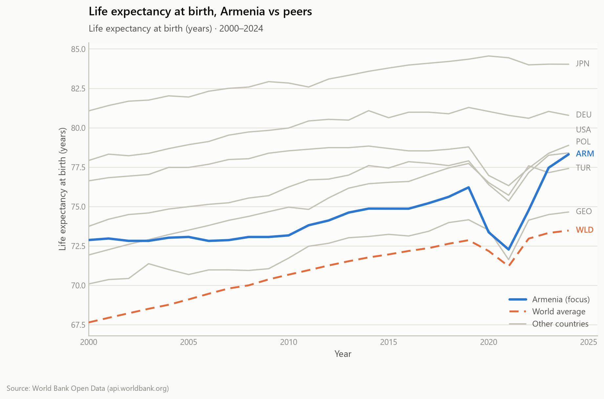
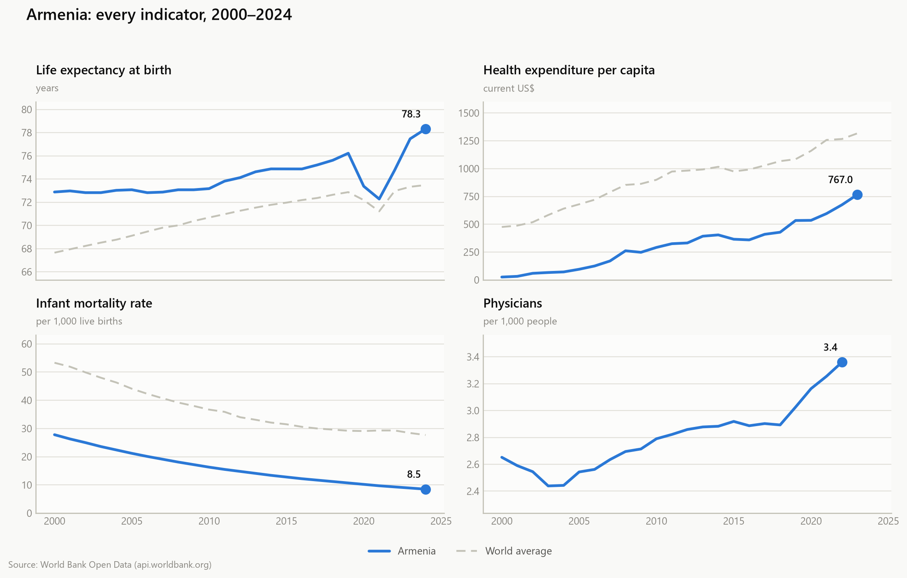
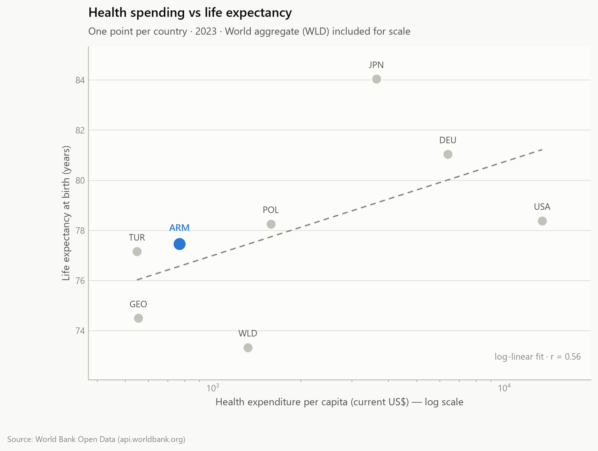

# DataPulse — API-to-Insights Pipeline 

An end-to-end data pipeline in Python: pull health statistics from a public API, clean them, measure the trends, and turn the result into charts and a written report.

One command takes you from an HTTP request to five publication-quality figures and a Markdown report:

```bash
python main.py
```

**Source:** [World Bank Open Data API](https://datahelpdesk.worldbank.org/knowledgebase/articles/889392) — public, no API key required.
**Scope:** 4 health indicators × 8 countries × 2000–2024.

---

## Pipeline

```
          ┌──────────────┐
          │  World Bank  │   4 endpoints, one per indicator
          │     API      │
          └──────┬───────┘
                 │  requests + retry/backoff, 24 h disk cache
                 ▼
   1. COLLECT  src/fetch.py ─────────────────────► data/raw/*.json
                 │  nested JSON → flat DataFrame
                 ▼
   2. CLEAN    src/clean.py ─────────────────────► data/processed/clean_*.csv
                 │  filter → dedupe → validate → complete grid
                 │  → drop sparse series → interpolate short gaps
                 ▼
   3. ANALYSE  src/analyze.py ───────────────────► data/processed/*.csv
                 │  trends · CAGR · YoY · rankings · correlations
                 ▼
   4. VISUALISE src/visualize.py ────────────────► figures/*.png
                 │  5 figures, light + dark themes
                 ▼
   5. EXPORT   src/report.py ────────────────────► reports/insights.md
```

Each stage runs standalone (`python -m src.clean`) or as one pass via `main.py`.

---

## Key insights

Charts and numbers below are produced by the pipeline, not written by hand.

**Armenia gained 5.4 years of life expectancy** between 2000 and 2024 (72.9 → 78.3) — more than Germany (+2.9), Japan (+3.0) or the United States (+2.3) added over the same period. The countries that started furthest behind closed the most ground.



**Infant mortality fell by roughly two thirds** in Armenia (27.8 → 8.5 per 1,000 live births) — the largest proportional improvement in the panel.



**Spending explains less than you would expect.** Across all country-years, health expenditure per capita correlates with life expectancy at r ≈ 0.57 (on a log scale), while infant mortality correlates at r ≈ −0.78. The United States spends several times more per person than anyone else here and still lands below the life expectancy its own trend line predicts.



**The 2020–21 shock hit everyone, and the recovery was uneven.** By 2023, Armenia, Georgia, Poland and the world average were back above their 2019 level; Germany, Japan, Türkiye and the United States were not.

Full write-up with every table: **[reports/insights.md](reports/insights.md)** · Step-by-step walkthrough: **[notebooks/pipeline.ipynb](notebooks/pipeline.ipynb)**

---

## Setup

```bash
git clone https://github.com/<your-username>/datapulse.git
cd datapulse

python -m venv .venv
source .venv/bin/activate       # Windows: .venv\Scripts\activate

pip install -r requirements.txt
python main.py
```

Python 3.10+. First run fetches from the API (a few seconds); later runs reuse the cache in `data/raw/`.

### CLI 

```bash
python main.py                      # full run, cache used when fresh
python main.py --refresh            # ignore the cache, re-fetch
python main.py --country GEO        # focus the figures on another country
python main.py --themes light dark  # render both colour themes
python main.py --start-year 2010    # narrow the window
python main.py --no-report          # skip the Markdown export
```

### Notebook 

```bash
jupyter notebook notebooks/pipeline.ipynb
```

### Tests

```bash
pytest
```

18 tests covering the cleaning and analysis logic on synthetic data — no network required.

---

## How the data is cleaned 

Raw API output is not analysis-ready, so `src/clean.py` runs six passes and logs every one:

| Pass | What it does | Why |
| --- | --- | --- |
| Structural filter | drop rows with no ISO-3 code or year outside the window | regional aggregates come back with an empty country code |
| De-duplicate | one row per (country, indicator, year) | revisions can produce repeats |
| Validate | null out negative values | none of these indicators can be below zero |
| Complete grid | expand to every country × indicator × year | otherwise "stopped reporting" is indistinguishable from "series ended" |
| Drop sparse series | discard series below 50% coverage | three points is not a trend — this removes physicians data for WLD, USA and JPN |
| Interpolate short gaps | fill NaN runs of ≤ 2 years, flag them in `is_imputed` | longer holes stay empty, and filled points are drawn hollow so they are never mistaken for observations |

Trend endpoints are each series' own first and last **observed** year, so a country that stops reporting in 2022 is measured over its own span rather than credited with two extra years.

---

## Chart design 

Every figure comes out of one system, defined once in `src/theme.py`:

- **Form follows the job.** One country against seven peers is an *emphasis* chart (accent + grey), not eight competing colours. Four indicators in four units get *small multiples*, never a dual y-axis. Change against zero gets a *diverging* palette.
- **Colour is validated, not eyeballed.** The categorical pair (`#2a78d6` / `#eb6834` light, `#3987e5` / `#d95926` dark) passes lightness-band, chroma, contrast and colour-vision-deficiency separation checks against both surfaces — worst-pair CVD ΔE 24.7 light, 26.8 dark.
- **Identity never rests on colour alone.** Every chart carries direct labels, dash patterns or a legend.
- **Chrome recedes:** hairline horizontal grid, no top/right spines, muted tick text.

Light figures live in `figures/`, dark in `figures/dark/`.

---

## Project structure

```
datapulse/
├── main.py                  # CLI runner — the whole pipeline in one pass
├── notebooks/
│   └── pipeline.ipynb       # step-by-step narrative with outputs
├── src/
│   ├── config.py            # countries, indicators, paths, cleaning thresholds
│   ├── fetch.py             # 1 · collect — API, retries, caching, JSON → DataFrame
│   ├── clean.py             # 2 · clean  — filter, dedupe, grid, interpolate
│   ├── analyze.py           # 3 · analyse — trends, YoY, rankings, correlations
│   ├── visualize.py         # 4 · visualise — five figures, two themes
│   ├── report.py            # 5 · export — Markdown report
│   └── theme.py             # the chart design system
├── tests/
│   └── test_pipeline.py     # 18 tests, no network
├── data/
│   ├── raw/                 # cached API JSON
│   └── processed/           # clean + analysis CSVs
├── figures/                 # PNG output (dark/ subfolder)
├── reports/insights.md      # generated report
├── requirements.txt
└── .gitignore
```

---

## Indicators 

| Indicator | World Bank code | Unit | 
| --- | --- | --- |
| Life expectancy at birth | `SP.DYN.LE00.IN` | years |
| Health expenditure per capita | `SH.XPD.CHEX.PC.CD` | current US$ |
| Infant mortality rate | `SP.DYN.IMRT.IN` | per 1,000 live births |
| Physicians | `SH.MED.PHYS.ZS` | per 1,000 people |

Countries: Armenia, Georgia, Türkiye, Poland, Germany, Japan, United States, plus the World aggregate as a baseline. Change any of this in [`src/config.py`](src/config.py) — nothing else needs editing.

---

## Caveats

- Health expenditure is reported in **current US$** — nominal, so its growth mixes real spending with inflation and exchange-rate moves. The report labels it rather than calling it an improvement.
- Interpolated points are estimates. They are flagged in `is_imputed` and drawn hollow.
- Eight countries is a convenience sample chosen for regional contrast; the correlations describe this panel, not the world.

---

## Built with

Python · [requests](https://requests.readthedocs.io/) · [pandas](https://pandas.pydata.org/) · [matplotlib](https://matplotlib.org/) · [pytest](https://docs.pytest.org/)

Data: [World Bank Open Data](https://data.worldbank.org) ([CC BY 4.0](https://datacatalog.worldbank.org/public-licenses#cc-by))
