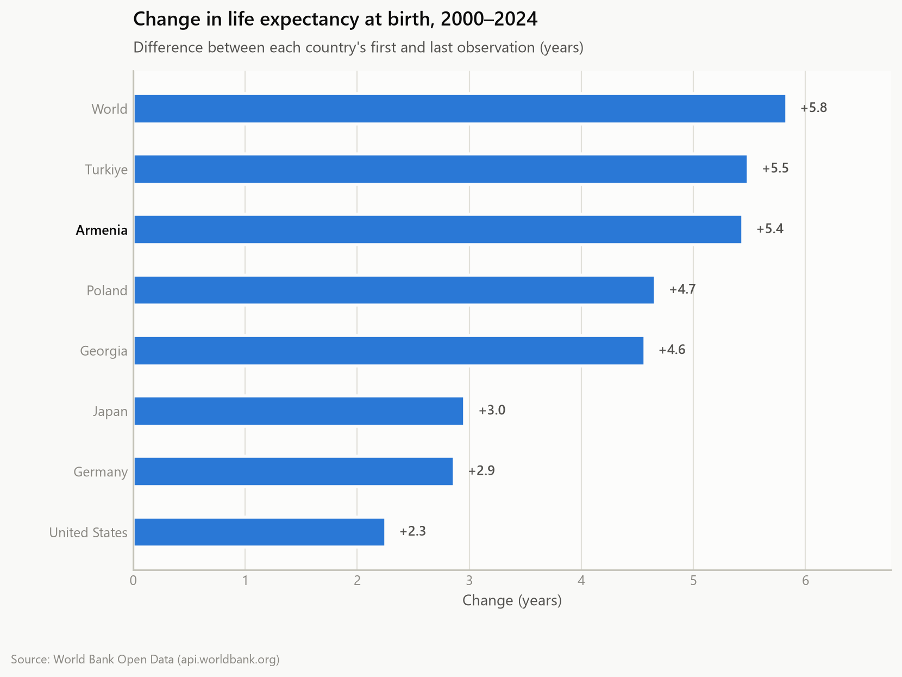
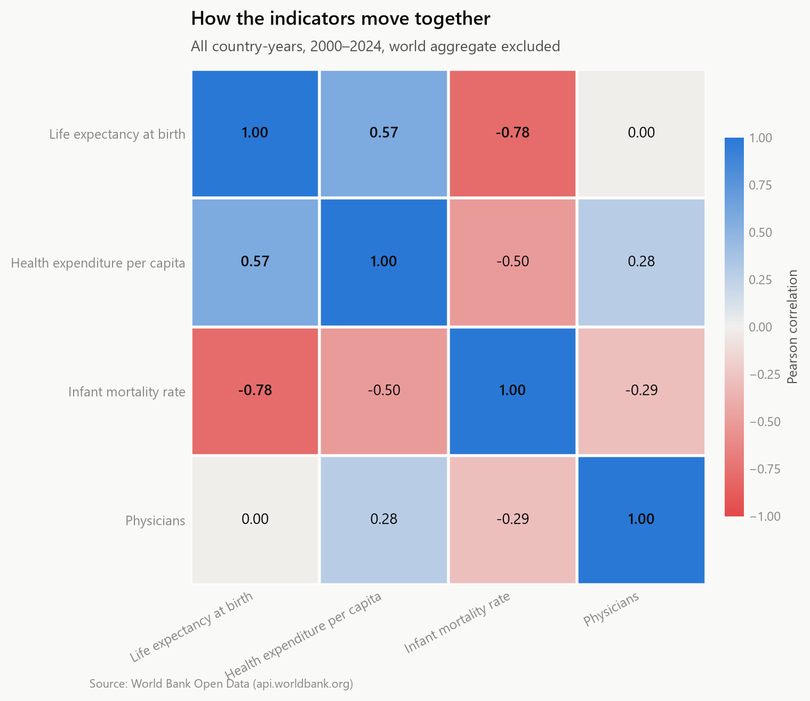

# DataPulse — health indicator insights

*Generated 2026-08-10 15:42 UTC · 2000–2024 · 8 countries · 4 indicators · focus: Armenia*

## Headline insights

- **Health expenditure per capita** in Armenia moved from 25.7 (2000) to 767.0 (2023) — +741.3 current US$, a nominal rise (current US$, so the movement mixes real spending growth with inflation and exchange-rate changes).
- **Infant mortality rate** in Armenia moved from 27.8 (2000) to 8.5 (2024) — -19.3 per 1,000 live births, an improvement.
- **Life expectancy at birth** in Armenia moved from 72.9 (2000) to 78.3 (2024) — +5.4 years, an improvement.
- **Physicians** in Armenia moved from 2.7 (2000) to 3.4 (2022) — +0.7 per 1,000 people, an improvement.
- The strongest relationship in the panel is **Life expectancy at birth** vs **Infant mortality rate** (r = -0.78 across all country-years).

## Life expectancy by country

| Country | First observation | Latest observation | Change (years) | CAGR |
| --- | --- | --- | --- | --- |
| World | 67.65 (2000) | 73.48 (2024) | +5.83 | +0.35%/yr |
| Turkiye | 71.93 (2000) | 77.42 (2024) | +5.49 | +0.31%/yr |
| Armenia | 72.88 (2000) | 78.32 (2024) | +5.44 | +0.30%/yr |
| Poland | 73.75 (2000) | 78.41 (2024) | +4.66 | +0.26%/yr |
| Georgia | 70.09 (2000) | 74.66 (2024) | +4.57 | +0.26%/yr |
| Japan | 81.08 (2000) | 84.04 (2024) | +2.96 | +0.15%/yr |
| Germany | 77.93 (2000) | 80.79 (2024) | +2.87 | +0.15%/yr |
| United States | 76.64 (2000) | 78.89 (2024) | +2.25 | +0.12%/yr |

## Every indicator for Armenia

| Indicator | First | Latest | Change |
| --- | --- | --- | --- |
| Health expenditure per capita | 25.7 (2000) | 767.0 (2023) | +741.3 current US$ (+2888.9%) — a nominal rise *(current US$, so the movement mixes real spending growth with inflation and exchange-rate changes)* |
| Infant mortality rate | 27.8 (2000) | 8.5 (2024) | -19.3 per 1,000 live births (-69.4%) — an improvement |
| Life expectancy at birth | 72.9 (2000) | 78.3 (2024) | +5.4 years (+7.5%) — an improvement |
| Physicians | 2.7 (2000) | 3.4 (2022) | +0.7 per 1,000 people (+26.7%) — an improvement |

## Figures

### Focus country against its peers

### Every indicator for the focus country

### Health spending vs life expectancy

### Change across the whole period

### How the indicators move together

## Method

1. **Collect** — one World Bank endpoint per indicator, cached as raw JSON in `data/raw/`.
2. **Clean** — structural filtering, de-duplication, an explicit country x year x indicator grid, series below 50% coverage dropped, gaps of at most 2 years interpolated and flagged in `is_imputed`.
3. **Analyse** — trends, year-over-year change, rankings, gap to the world baseline, indicator correlations.
4. **Visualise** — five figures rendered in light and dark themes.

### Reading the numbers

- Endpoints are each series' own first and last **observed** year, which is why the years differ between rows.
- Health expenditure is reported in **current US$** — nominal, so it is not comparable across years in real terms.
- Interpolated points are marked in the data (`is_imputed`) and drawn hollow in the charts.

*Source: World Bank Open Data — https://data.worldbank.org*
